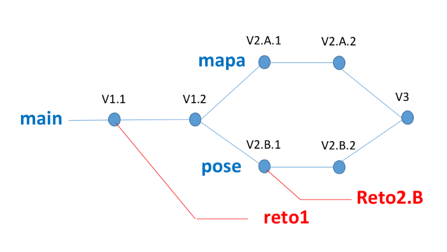

# Taller-de-Drones

#### _Nombre del taller: Taller de Drones_

## **1. Presentación**

En este taller vas a aprender a desarrollar programas en Python para **controlar la operación de
un dron**. Aprenderás a crear un programa con una **interfaz gráfica** que use botones para
ordenar al dron que despegue o vuele en una dirección determinada, que presentará al
usuario un **mapa** en el que mostrará la posición del dron en todo momento y que permitirá
**guiar el dron con las poses de tu cuerpo**, utilizando técnicas de reconocimiento de imagen.

En este repositorio encontrarás:
1. Los **códigos** de referencia para la realización del taller.
2. Material **escrito**.
3. **Vídeos** que te guiarán durante el proceso.
   
Aprenderás instalando esos códigos, analizándolos, modificándolos y ampliándolos.

El taller admite diferentes grados de implicación. Puedes limitarte a instalar los códigos, 
comprobar que funcionan correctamente y examinarlos. Eso no te llevará más de 1 hora.
Puedes también enfrentarte a unos cuantos retos concretos que te iremos proponiendo, y que
requerirán que añadas código de tu propia cosecha. **En el repositorio encontrarás los códigos
que resuelven esos retos**, para el caso en que necesites ayuda. Esta modalidad te llevará unas
2 horas. Finalmente, puedes abordar tus propios retos, porque seguro que te vas a imaginar
cosas. Ya no podemos indicarte cuántas horas te llevará eso, porque podrías consagrar tu vida
entera a añadir funcionalidades interesantes.

Los códigos que vas a desarrollar interactúan en realidad con un **simulador del dron**, de
manera que solo necesitas tu portátil, las instalaciones que te indicaremos y los códigos de
referencia.

No obstante, existe un segundo taller en el que tus códigos harán volar un **dron real** (para lo
cual tendrás que modificar solo un par de líneas de tu código). Naturalmente, ese segundo
taller se realiza de forma presencial en las instalaciones **del campus del Baix Llobregat de la
UPC, en Castelldefels**.


  <a href="https://www.youtube.com/watch?v=P_NCKA_3-PQ">, <a href="https://www.youtube.com/watch?v=UPyklN9namM">
    , 
  </a>


## 2. Etapas del taller

El taller está organizado en 4 etapas, que se describen a continuación:

**- Etapa 1**: Se desarrolla un programa en **Python** con una **interfaz gráfica** basada en botones con
los que controlar la operación del dron (operaciones básicas como **armar, despegar, volar en
diferentes direcciones** o **aterrizar**). En esta etapa se plantean un par de **retos**, cuya solución
también puede encontrarse en el repositorio.

**- Etapa 2.A:** Se añade al resultado de la Etapa 1 un **mapa** que permite mostrar al usuario la
posición del dron en cada momento. También se plantean un par de **retos** que permiten al
usuario interactuar con el dron a través del mapa.

**- Etapa 2.B:** Se añade al resultado de la Etapa 1 el código necesario para guiar el dron mediante
las **poses del cuerpo**, detectadas a través de la cámara del portátil. De nuevo se plantearán dos
**retos** para ampliar las funcionalidades de esta versión.

**- Etapa 3:** Consiste en integrar en una única aplicación los desarrollos de las etapas anteriores,
puesto que las etapas **2.A** y **2.B** se desarrollarán **de manera independiente y en cualquier
orden.**

<a id="esquema"></a>

<p>
  
</p>

Como ya se ha indicado, en cualquiera de esas etapas es posible plantearse retos mucho más
ambiciosos que los que se propondrán. Eso ya dependerá de tu nivel de motivación y del
tiempo que quieras dedicar a este taller.

## 3. Herramientas

Para realizar el taller necesitarás instalar en tu ordenador las herramientas siguientes:

**- Git:** Es una herramienta muy popular para la gestión de versiones. Con esta herramienta
podrás instalar en tu ordenador (clonar) este repositorio y acceder a los códigos de las
diferentes etapas.<br />
https://git-scm.com/downloads

**- Mission Planner:** Es una aplicación de escritorio que **permite interactuar con el dron**. Por
ejemplo, permite configurar muchos parámetros del dron y darle ordenes típicas (armar,
despegar, volar a un punto dado, etc.). Mission Planner permite también poner en marcha un
**simulador del dron**, que llamaremos **SITL** (Software In The Loop). Tanto Mission Planner como
las aplicaciones que se desarrollan en este taller **interactúan con el simulador, exactamente
igual que como lo harían con el dron real**. Esto es ideal para desarrollar y verificar el correcto
funcionamiento de los códigos antes de usarlos para controlar el dron real (cosa que podrás
hacer si realizas el segundo taller al que hemos hecho referencia en la presentación).<br />
https://ardupilot.org/planner/docs/mission-planner-installation.html

<p>
  
</p>

**- PyCharm:** Se trata de la aplicación más popular para el desarrollo de código en Python.
Asegurate de instalar la versión denominada Community Edition, que es gratuita y más que
suficiente.<br />
https://www.jetbrains.com/pycharm/

**- Python:** Necesitarás un intérprete de Python. Puedes utilizar las versiones más actuales.<br />
https://www.python.org/downloads/

Además, durante el taller tendrás que instalar en el entorno de desarrollo creado por Pycharm
diferentes librerías. Por ejemplo:

```bash
from pymavlink import mavutil
```

```bash
import tkintermapview
import mediapipe as mp
```

Dónde: 

**- _Pymavlink:_** contiene una gran variedad de funciones que permiten controlar el dron
desde código en Python.

**- _TkinterMapView:_** widget para la librería Tkinter que permite la visualización y manipulación interactiva de mapas basados en mosaicos. Se usará en la rama **mapa** del proyecto.

**- _Mediapipe:_** tiene una variedad de funciones para procesar imágenes. Es la librería que
usaremos para detectar **poses** del cuerpo.


## 4. Estructura del repositorio

Una vez hayas instalado Git en tu ordenador, ya puedes clonar el repositorio, que está
organizado tal y como muestra en el esquema de la sección [Etapas del taller](#esquema).

En el repositorio puedes acceder al código de las 4 etapas, puesto que las diferentes versiones
de la aplicación están convenientemente etiquetadas. Por ejemplo, en la etiqueta **V1.1
tenemos el código base de la Etapa 1**, perfectamente operativo, en el que puedes aprender
cómo implementar una interfaz gráfica con botones para controlar el dron. En la etiqueta **V1.2
tienes el código después de haber resuelto los dos retos** que se te plantearán en esa etapa. De
la misma manera, encontrarás en la etiqueta **V2.A.1 el código base de la etapa 2.A** y en **V2.A.2
el código resultante de resolver los retos propuestos**.

--- 

### 4.1. Git

La herramienta **Git te permite crear ramas para tus propios desarrollos.** De hecho, la figura
muestra que el código tiene una rama principal **(main)** que se **divide en dos ramas (mapa y
pose)** que luego **se funden de nuevo en la rama main.** **Tu puedes crear las ramas necesarias
para tus desarrollos.** Por ejemplo, la [figura](#esquema) indica que se ha creado una rama llamada _reto1_ en
la que el usuario desarrollará el código para abordar los retos de la etapa 1. De la misma forma
han creado las ramas reto2.A y reto2.B para los retos de esas etapas. Naturalmente, **Git permite moverse por esa estructura de ramas y versiones**, lo cual permite, por ejemplo, consultar el código del reto resuelto en caso de ser necesario.

En el vídeo siguiente puedes ver cómo **clonar el repositorio**, **moverte por las diferentes
versiones**, **crear las ramas** necesarias para tus propios desarrollos y **moverte por el repositorio
de una rama a otra** o de una versión a otra.

[VÍDEO 2]

---

### 4.2 Para empezar a programar

Una vez instalado **Git, Mission Planner, Pycharm** y el intérprete de **Python**, mira este video e
intenta reproducir en tu ordenador lo que ves en él.

El video te muestra cómo **poner en marcha Mission Planner y el simulador SITL**. También
muestra cómo hacer un programa sencillo que **envía comandos al simulador del dron**, usando
la librería _**DronLib**_, que está incluida en el repositorio de este taller.

[VÍDEO 3]

---


