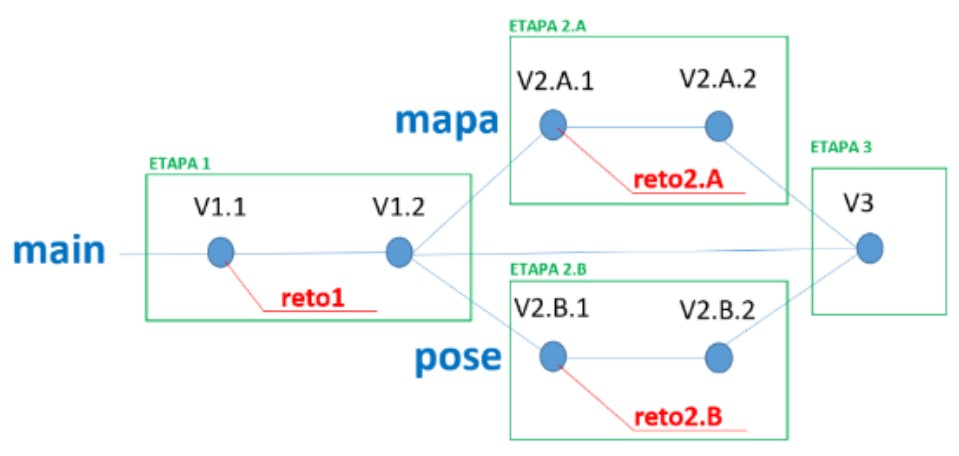

# Taller-de-Drones

#### _Nombre del taller: Taller de Drones_

## **1. Presentación**

En este taller vas a aprender a desarrollar programas en Python para **controlar la operación de
un dron**. Aprenderás a crear un programa con una **interfaz gráfica** que use botones para
ordenar al dron que despegue o vuele en una dirección determinada, que presentará al
usuario un **mapa** en el que mostrará la posición del dron en todo momento y que permitirá
**guiar el dron con las poses de tu cuerpo**, utilizando técnicas de reconocimiento de imagen.

En este repositorio encontrarás:
1. Los **códigos** de referencia para la realización del taller.
2. Material **escrito**.
3. **Vídeos** que te guiarán durante el proceso.
   
Aprenderás instalando esos códigos, analizándolos, modificándolos y ampliándolos.

<p>
  
</p>

El taller admite diferentes grados de implicación. Puedes limitarte a instalar los códigos, 
comprobar que funcionan correctamente y examinarlos. Eso no te llevará más de 1 hora.
Puedes también enfrentarte a unos cuantos retos concretos que te iremos proponiendo, y que
requerirán que añadas código de tu propia cosecha. **En el repositorio encontrarás los códigos
que resuelven esos retos**, para el caso en que necesites ayuda. Esta modalidad te llevará unas
2 horas. Finalmente, puedes abordar tus propios retos, porque seguro que te vas a imaginar
cosas. Ya no podemos indicarte cuántas horas te llevará eso, porque podrías consagrar tu vida
entera a añadir funcionalidades interesantes.

Los códigos que vas a desarrollar interactúan en realidad con un **simulador del dron**, de
manera que solo necesitas tu portátil, las instalaciones que te indicaremos y los códigos de
referencia.

No obstante, existe un segundo taller en el que tus códigos harán volar un **dron real** (para lo
cual tendrás que modificar solo un par de líneas de tu código). Naturalmente, ese segundo
taller se realiza de forma presencial en las instalaciones **del campus del Baix Llobregat de la
UPC, en Castelldefels**.

Mira este vídeo para ver una demo de la aplicación que se desarrolla en este taller.

  <a href="https://www.youtube.com/watch?v=P_NCKA_3-PQ">, 
  <a href="https://www.youtube.com/watch?v=UPyklN9namM">
    , 
  </a>


## 2. Etapas del taller

El taller está organizado en 4 etapas, que se describen a continuación:

- **Etapa 1**: Se desarrolla un programa en **Python** con una **interfaz gráfica** basada en botones con
los que controlar la operación del dron (operaciones básicas como **armar, despegar, volar en
diferentes direcciones** o **aterrizar**). En esta etapa se plantean un par de **retos**, cuya solución
también puede encontrarse en el repositorio.

- **Etapa 2.A:** Se añade al resultado de la Etapa 1 un **mapa** que permite mostrar al usuario la
posición del dron en cada momento. También se plantean un par de **retos** que permiten al
usuario interactuar con el dron a través del mapa.

- **Etapa 2.B:** Se añade al resultado de la Etapa 1 el código necesario para guiar el dron mediante
las **poses del cuerpo**, detectadas a través de la cámara del portátil. De nuevo se plantearán dos
**retos** para ampliar las funcionalidades de esta versión.

- **Etapa 3:** Consiste en integrar en una única aplicación los desarrollos de las etapas anteriores,
puesto que las etapas **2.A** y **2.B** se desarrollarán **de manera independiente y en cualquier
orden.**

En este repositorio encontrarás un apartado dedicado a cada una de estas etapas en las que se
describirá (**con texto y videos**) las funcionalidades de la versión inicial de esa etapa, los retos
que te proponemos (y que también encontrarás resueltos) y una lista de posibles retos más
ambiciosos que esperamos que despierten tu interés.

## 3. Herramientas 

Para realizar el taller necesitarás instalar en tu ordenador las herramientas siguientes:

- **Git:** Es una herramienta muy popular para la gestión de versiones. Con esta herramienta
podrás instalar en tu ordenador (clonar) este repositorio y acceder a los códigos de las
diferentes etapas.<br />
https://git-scm.com/downloads

- **Mission Planner:** Es una aplicación de escritorio que **permite interactuar con el dron**. Por
ejemplo, permite configurar muchos parámetros del dron y darle ordenes típicas (armar,
despegar, volar a un punto dado, etc.). Mission Planner permite también poner en marcha un
**simulador del dron**, que llamaremos **SITL** (Software In The Loop). Tanto Mission Planner como
las aplicaciones que se desarrollan en este taller **interactúan con el simulador, exactamente
igual que como lo harían con el dron real**. Esto es ideal para desarrollar y verificar el correcto
funcionamiento de los códigos antes de usarlos para controlar el dron real (cosa que podrás
hacer si realizas el segundo taller al que hemos hecho referencia en la presentación).<br />
https://ardupilot.org/planner/docs/mission-planner-installation.html

<p>
  
</p>
<a id="installs"></a>

- **PyCharm:** Se trata de la aplicación más popular para el desarrollo de código en Python.
Asegurate de instalar la versión denominada Community Edition, que es gratuita y más que
suficiente.<br />
https://www.jetbrains.com/pycharm/

- **Python:** Necesitarás un intérprete de Python. Puedes utilizar las versiones más actuales.<br />
https://www.python.org/downloads/

Además, durante el taller tendrás que instalar en el entorno de desarrollo creado por Pycharm
diferentes librerías. Por ejemplo:

```bash
from pymavlink import mavutil
```

```bash
import tkintermapview
import mediapipe as mp
```

Dónde: 

- **_Pymavlink:_** contiene una gran variedad de funciones que permiten controlar el dron
desde código en Python. 

- **_TkinterMapView:_** widget para la librería Tkinter que permite la visualización y manipulación interactiva de mapas basados en mosaicos. Se usará en la rama **mapa** del proyecto.

- **_Mediapipe:_** tiene una variedad de funciones para procesar imágenes. Es la librería que
usaremos para detectar **poses** del cuerpo.


## 4. Estructura del repositorio

Una vez hayas instalado Git en tu ordenador, ya puedes clonar el repositorio, que está
organizado tal y como muestra en la figura:

<a id="esquema"></a>

<p>
  
</p>

En el repositorio puedes acceder al código de las 4 etapas, puesto que las diferentes versiones
de la aplicación están convenientemente etiquetadas. Por ejemplo, en la etiqueta **V1.1
tenemos el código base de la Etapa 1**, perfectamente operativo, en el que puedes aprender
cómo implementar una interfaz gráfica con botones para controlar el dron. En la etiqueta **V1.2
tienes el código después de haber resuelto los dos retos** que se te plantearán en esa etapa. De
la misma manera, encontrarás en la etiqueta **V2.A.1 el código base de la etapa 2.A** y en **V2.A.2
el código resultante de resolver los retos propuestos**.

--- 

### Git

La herramienta **Git te permite crear ramas para tus propios desarrollos.** De hecho, la figura
muestra que el código tiene una rama principal **(main)** que se **divide en dos ramas (mapa y
pose)** que luego **se funden de nuevo en la rama main.** **Tu puedes crear las ramas necesarias
para tus desarrollos.** Por ejemplo, la [figura](#esquema) indica que se ha creado una rama llamada _reto1_ en
la que el usuario desarrollará el código para abordar los retos de la etapa 1. De la misma forma
han creado las ramas reto2.A y reto2.B para los retos de esas etapas. Naturalmente, **Git permite moverse por esa estructura de ramas y versiones**, lo cual permite, por ejemplo, consultar el código del reto resuelto en caso de ser necesario.

En el vídeo siguiente puedes ver cómo **clonar el repositorio**, **moverte por las diferentes
versiones**, **crear las ramas** necesarias para tus propios desarrollos y **moverte por el repositorio
de una rama a otra** o de una versión a otra.

[VÍDEO 2]

---

### Para empezar a programar

Una vez instalado **Git, Mission Planner, Pycharm** y el intérprete de **Python**, mira este video e
intenta reproducir en tu ordenador lo que ves en él.

El video te muestra cómo **poner en marcha Mission Planner y el simulador SITL**. También
muestra cómo hacer un programa sencillo que **envía comandos al simulador del dron**, usando
la librería _**DronLib**_, que está incluida en el repositorio de este taller.

[VÍDEO 3]

---

### La librería DronLib

DronLib es la librería que vamos a usar para **darle ordenes al dron** (tanto al simulador SITL
como al dron real). Es una **librería en desarrollo en la UPC** (y por tanto, no exenta de fallos) que
pretende ser una alternativa a DroneKit, que es la más utilizada, pero que ya no está en
mantenimiento y no es compatible con las versiones más avanzadas del intérprete de Python.

La librería esta implementada en forma de clase **(la clase Dron)** con sus atributos y una
variedad de métodos para operar con el dron. La clase con los atributos está definida en el
fichero _Dron.py_ y los métodos están en los diferentes ficheros de la carpeta _modules_
(connect.py, arm.py, etc.).

Muchos de los métodos pueden activarse **de forma bloqueante o de forma no bloqueante**. En
el primer caso, **el control no se devuelve al programa que hace la llamada hasta que la
operación ordenada haya acabado**. Si la llamada es no bloqueante entonces **el control se
devuelve inmediatamente** para que el programa pueda hacer otras cosas mientras se realiza la
operación.

Un ejemplo de método con estas dos opciones es _takeOff_, que tiene la siguiente cabecera:


```bash
def takeOff(self, aTargetAltitude, blocking=True, callback=None , params = None)
```

Al llamar a este método hay que pasarle como parámetro la **altura de despegue**. Por defecto la
operación es **bloqueante**. En el caso de usar la opción no bloqueante se puede indicar el
nombre de la función que queremos que se ejecute cuando la operación haya acabado (que
llamamos habitualmente **callback**). Incluso podemos indicar los parámetros que queremos que
se le pasen a ese callback. **Recuerda que self no es ningún parámetro**. Simplemente **indica que
este es un método de una clase** (en este caso, la clase Dron).

Los siguientes ejemplos aclararán estas cuestiones.

---

### Ejemplo 1

```bash
from Dron import Dron
dron = Dron()
dron.connect (&#39;tcp:127.0.0.1:5763&#39;, 115200) # me conecto al simulador
print (‘Conectado’)
dron.arm()
print (‘Armado’)
dron.takeOff (8)
print (‘En el aire a 8 metros de altura’)
```

En este ejemplo todas las llamadas son bloqueantes.

--- 

### Ejemplo 2

```bash
from Dron import Dron
dron = Dron()
dron.connect (&#39;tcp:127.0.0.1:5763&#39;, 115200) # me conecto al simulador
print (‘Conectado’)
dron.arm()
print (‘Armado’)
dron.takeOff (8, blocking = False) # llamada no bloqueante, sin callback
print (‘Hago otras cosas mientras se realiza el despegue’)
```

---

### Ejemplo 3

```bash
from Dron import Dron
dron = Dron()
dron.connect (&#39;tcp:127.0.0.1:5763&#39;, 115200) # me conecto al simulador
print (‘Conectado’)
dron.arm()
print (‘Armado’)
def enAire (): # esta es la función que se activa al acabar la operación (callback)
print (‘Por fin ya estás en el aire a 8 metros de altura’)
# llamada no bloqueante con callback
dron.takeOff (8, blocking = False, callback= enAire)
print (‘Hago otras cosas mientras se realiza el despegue’)
```

---

### Ejemplo 4

```bash
from Dron import Dron
dron = Dron()
dron.connect (&#39;tcp:127.0.0.1:5763&#39;, 115200) # me conecto al simulador
print (‘Conectado’)
dron.arm()
print (‘Armado’)
def informar (param):
print (‘Mensaje del dron: ‘, param)
# Llamada no bloqueante, con callback y parámetro para el callback
dron.takeOff (8, blocking = False, callback= informar,
params= ‘En el aire a 8 metros de altura’)

print (‘Hago otras cosas mientras se realiza el despegue. Ya me avisarán’)
```

En este ejemplo usamos un **callback que puede ser utilizado en otros momentos**, como por
ejemplo al hacer un RTL no bloqueante, en cuyo caso el callback podría ser el mismo, pero con
un parámetro diferente (como, por ejemplo, ‘Por fin en casa’).

---

### Ejemplo 5

```bash
from Dron import Dron
dron = Dron()
# conexión con identificador del dron
dron.connect (&#39;tcp:127.0.0.1:5763&#39;, 115200, id=1)
print (‘Conectado’)
dron.arm()
print (‘Armado’)
# La función del callback recibirá el id del dron como primer parámetro
def informar (id, param):
print (‘Mensaje del dron ‘+str(id) + ‘: ‘ + param)
dron.takeOff (8, blocking = False, callback= informar,
params= ‘En el aire a 8 metros de altura’)
print (‘Hago otras cosas mientras se realiza el despegue. Ya me avisarán’)
```

En este ejemplo usamos la opción de identificar al dron **en el momento de la conexión**
(podríamos tener varios drones, cada uno con su identificador). Si usamos esa opción entonces
el método de la librería va a añadir siempre ese identificador como primer parámetro del
callback que le indiquemos.

La modalidad no bloqueante en las llamadas a la librería es especialmente útil **cuando
queremos interactuar con el dron mediante una interfaz gráfica**. Por ejemplo, no vamos a
querer que se bloquee la interfaz mientras el dron despega. Seguramente querremos seguir
procesando los datos de telemetría mientras el dron despega, para mostrar al usuario, por
ejemplo, la altura del dron en todo momento.

---

## 5. Funciones de la clase Dron

A continuación se describen las funciones de la clase Dron que se usan en este taller. En
muchas de ellas aparecen los tres parámetros requeridos para implementar la modalidad no
bloqueante (_blocking_, _callback_ y _params_).

---

```bash
def connect(self,
  connection_string, baud,
  id=None,
  blocking=True, callback=None, params = None)
```

**Conecta con el dron**. Los parámetros _connection_string_ y _baud_ indican si hay que **conectar con
el simulador o con el dron real**, y la **velocidad de comunicación**. Para conectar con el simulador
típicamente el string de conexión es: ‘**_tcp:127.0.0.1:5763_**’ y la velocidad es **115200**.
La conexión admite una identificador para el dron, que la librería añadirá como primer parámetro
en todas las funcione callback.

---

```bash
def disconnect (self)
```

**Desconecta el dron**. Además, detiene el envío de datos de telemetría y espera 5 segundos antes
de retornar.

---

```bash
def arm(self, blocking=True, callback=None, params = None)
```

**Arma el dron.**

---

```bash
def takeOff(self,
   aTargetAltitude,
   blocking=True, callback=None, params = None)
```

**Despega el dron** hasta alcanzar la altura indicada en el parámetro.

---

```bash
def startGo(self)
```

**Pone al dron en modo navegación**, para que acepte las ordenes de navegar en dirección Norte,
Sur, etc.

---

```bash
def stopGo(self)
```

**Para el modo navegación**. Es necesario hacer esto antes de ordenar otras operaciones (como por
ejemplo dirigirse a un punto determinado).

---

```bash
def changeNavSpeed (self, speed)
```

**Cambia la velocidad** del dron cuando está en modo navegación.

---

```bash
def go(self, direction))
```

Hace que el dron navegue en la dirección indicada. Las opciones son: _‘North’, ‘South’,
‘West’, ‘East’, ‘NorthWest’, ‘NorthEast’, ‘SouthWest’, ‘SouthEast’, ‘Stop’_.

---

```bash
def getParams(self,
   parameters,
   blocking=True, callback=None)
```

**Pide al dron el valor de los parámetros indicados**. En el caso de que la llamada sea o bloqueante,
ejecutará la función del callback pasándole como parámetro la lista de valores recibida (y el
identificador del dron como primer parámetro en el caso de que el dron haya sido identificando en
el momento de la conexión). Este ejemplo **muestra cómo se pasa la lista de parámetros** (en
formato **json**) cuyo valor se quiere recuperar y como se revuelve la lista de valores de esos
parámetros.

```bash
parameters = json.dumps([
    "RTL_ALT",
    "PILOT_SPEED_UP",
    "FENCE_ACTION"
])
result = dron.getParams(parameters)
values = json.loads(result)
print('Valores:' ,values)
```

El resultado podría ser:

```bash
Valores: [{'RTL_ALT:' -1.0}, {'PILOT_SPEED_UP:' 100.0}, {'FENCE_ACTION:' 4.0}]
```

---

```bash
def setParams(self,
   parameters,
   blocking=True, callback=None, params = None)
```

Establece el valor de los parámetros que se le pasan en una lista en formato json. Un ejemplo de
uso es este:

```bash
parameters = json.dumps([
      {ID: "FENCE_ENABLE", Value: 1},
      {ID: "FENCE_ACTION", Value: 4},
])
dron.setParams(parameters)
```

---

```bash
def RTL (self, blocking=True, callback=None, params = None)
```

Ordena al dron que retorne a casa (**Return to launch**).

---

```bash
def Land (self, blocking=True, callback=None, params = None)
```

Ordena al dron que **aterrice** en el punto que está sobrevolando.

---

```bash
def setGEOFence(self,
  fence_waypoints,
  blocking=True, callback=None, params = None)
```

Envía al dron la **configuración del geofence**, que consiste en la lista de las coordenadas geográficas
que **delimitan el polígono** (al menos 3 puntos), en formato json. Un ejemplo puede ser este:

```bash
fence_waypoints = json.dumps([
  {'lat': 41.123, 'lon': 1.988},
  {'lat': 41.234, 'lon': 1.999},
  {'lat': 41.150, 'lon': 1.870}
])
dron.setGEOFence(fence_waypoints)
```

---

```bash
def send_telemetry_info(self, process_telemetry_info)
```

Pide al dron que envíe los **datos de telemetría**. Cuando el dron tiene un nuevo paquete de
telemetría llama al callback y le pasa ese paquete en formato json (y el identificador del dron
como primer parámetro en el caso de que el dron haya sido identificando en el momento de la
conexión). **El dron va a enviar 4 paquetes por segundo**. El ejemplo siguiente muestra el formato en
que se reciben los datos de telemetría:

```bash
def process_telemetry_info(self, telemetry_info):
   print ('info:', telemetry_info)
```

El resultado podría ser:

```bash
info:{'lat':41.276, 'lon':1.988, 'alt': -0.016, 'groundSpeed': 0.120, 'heading':
355.88, 'state': connected}
```

Los posibles estados en los que puede estar el dron son: _‘connected’, ‘disconnected’,
‘arming’, ‘armed’, ‘takingOff’, ‘flying’, ‘returning’, ‘landing’_.

---

```bash
def stop_sending_telemetry_info(self)
```

**Detiene el envío de datos de telemetría**.

---

```bash
def goto(self,
  lat, lon, alt,
  blocking=True, callback=None, params=None)
```

**Dirige al dron al punto geográfico indicado**. Esta no funciona si estamos en modo navegación.

---

## Etapa 1: Interfaz con botones

### Versión inicial

Accede al código de la versión inicial de esta etapa, que tiene la etiqueta **“v1.1”**. Al ejecutar el
código del programa principal (_Dashboard.py_) se mostrará una sencilla interfaz gráfica con
botones para realizar las **operaciones más básicas con el dron: conectar, armar, despegar,
mover el dron en diferentes direcciones y retornar a casa.**

Fíjate en el código que crea la interfaz gráfica basada en botones, que utiliza la **librería tkinter**.
Parece algo complejo, pero no lo es. Simplemente hay que imaginarse la interfaz como **una
matriz de filas y columnas**. El código indica qué elemento gráfico hay que colocar en cada
fila/columna de esa matriz. La mayoría de esos elementos son **botones**, pero algunos son
**_frames_** que internamente también están organizados como pequeñas matrices con sus filas,
sus columnas y sus elementos. Fíjate que hay algunos elementos de la interfaz que no se usan
y que puedes aprovechar si decides abordar los retos que te proponemos más adelante.

También es importante que veas cómo se usa nuestra librería con las funciones para controlar
el dron. Fíjate especialmente en el uso de las **llamadas no bloqueantes** y la forma en que se
indica qué función hay que ejecutar cuando haya acabado la operación solicitada.

Este vídeo contiene una **explicación del código de esta versión** y una **demostración de la
aplicación en funcionamiento**. Fíjate que para ejecutar el código tendrás que instalar la librería
**_pymavlink_** (recuerda que en la [sección _3. Herramientas_](#installs) se te da una explicación más detallada de la librería) .

[VIDEO] (Demo de la etapa 1)

---

### Retos

Te proponemos dos retos sencillos, cuya solución encontrarás en el código etiquetado con
“**v1.2**”.

- **Reto 1**: Añade botón para hacer que el dron aterrice en el punto sobre el que se encuentra.
Échale un vistazo a la librería de funciones de contro del dron. Seguro que encuentras allí la
función que necesitas.

- **Reto 2**: Añade algún elemento a la interfaz que te permita introducir la altura a la que quieres
que despegue el dron (que en la versión inicial es una altura fija).

### Más retos

Aquí tienes una lista con otros retos que podrías plantearte, si tienes ganas y tiempo.
Naturalmente **tendrás que investigar un poco la librería de funciones** para ver qué cosas se
pueden hacer con el dron:

1. Introduce un elemento de tipo _Scale_ (como el que se usa para especificar la velocidad
de vuelo) para especificar la altura de despegue.

3. Introduce los elementos necesarios para hacer que el **dron rote un cierto ángulo**
cuando está en el aire (cambio de heading).

5. Introduce algún elemento para que se muestre en todo momento **la altura** que tiene el
dron.

---

## Etapa 2.A: Interfaz con mapa

### Versión inicial

Puede encontrarse en el tag “**v2.A.1**”. La novedad más importante es la aparición de un **botón
que abre una ventana nueva**, cuyo código está en el fichero _MapFrame.py_, en el que se
muestra un **mapa navegable**, igual que los que nos muestra Google Maps o el propio Mission
Planner. En ese mapa podemos hacer que **se muestre el dron** y **seguir sus movimientos según
le indiquemos con los botones de navegación**, exactamente igual que los podemos seguir en el
mapa de Mission Planner. Analizando el código de esta versión aprenderás a **mostrar un mapa
de la zona que quieras** (indicando las coordenadas geográficas, a colocar una imagen en el 
mapa (por ejemplo, el icono del dron), a **capturar los eventos de ratón sobre el mapa** y **fijar
marcas o dibujar líneas**.

La función más interesante de esta versión es la **creación de un geofence**: un
**polígono que encierra al dron**, de manera que el dron no pueda escapar del interior de ese
polígono. Como puedes imaginar, esa es una **medida de seguridad extremadamente útil** para
realizar vuelos reales. Observa cómo se fija los puntos (coordenadas geográficas) que definen
el polígono y como se prepara la información que hay que enviarle a la librería de control del
dron para que establezca el geofence. Finalmente, es necesario **activar el geofence e indicar
qué acción debe hacer el dron si llega al límite del greofence**, que es nuestra aplicación será
quedarse parado en ese límite (fíjate ya de paso en la manera de cambiar cualquiera de los
muchos parámetros que tiene el dron, y que puedes listar desde Mission Planner clicando en
Config -> _Full parameter list_).

<p>
  
</p>

Este vídeo contiene una explicación del código de esta versión y una demostración de la
aplicación en funcionamiento. Fíjate que para ejecutar el código tendrás que instalar la librería
[**tkintermapview**](#installs).

[VIDEO] Demo etapa 2.A

---

### Retos

Los retos que te proponemos ahora no van a ser tan sencillo como los de la versión anterior.
Los encontrarás resueltos en la versión etiquetada con “**V.2.A.2**”.

- **Reto 1**: Introduce los elementos necesarios para poder **marcar un punto en el mapa** y hacer
**que el dron vuele hasta ese punto**. Para implementar esta funcionalidad necesitarás la función
_goto_ de la librería.

- **Reto 2**: Introduce los elementos necesarios para que **al clicar un botón se dibuje en el mapa el
rastro que deja el dron en su movimiento**. Ese botón debe servir para **activar** el rastro y para
**borrarlo**.

### Más retos: 

La lista de cosas que se pueden hacer es esta versión es infinita. Te proponemos algunos retos
(en muchos casos tendrás que investigar qué parámetros del dron hay que modificar):

1. Investiga cómo hacer para que la acción que realice el dron al **llegar al límite del
geofence sea un RTL** (retornar a casa)

2. El geofence no sólo tiene perímetro. También tiene **altura**. Si haces despegar el dron a
una altura superior a la que tiene el geofence se producirá un error y no despegará.
Introduce los elementos necesarios para poder **definir la altura que debe tener el
geofence**.

3. Cambia lo necesario para ver volar el dron sobre el césped del **Nou Camp**.

4. Introduce un botón que permita **activar o desactivar el geofence**, según convenga.

5. Modifica la función de dibujar el rastro para que puedas **activar o desactivar** **(no
borrar**) el dibujo del rastro. De esta manera podrás hacer dibujos sobre el área de
vuelo (como un pictionary que podría ver los extraterrestres)

---

## Etapa 2.B: Control del dron mediante poses

Puede encontrarse etiquetada con “**v2.B.1**”. Esta etapa puede realizarse inmediatamente
después de la etapa 1 (**no se necesita el código desarrollado en la etapa 2.A**).

En la versión inicial se ha incluido un botón que abre una ventana en la que se muestran
**diferentes poses del cuerpo** de manera que si el usuario hace alguna de esas poses delante de
la cámara de su portátil el dron realizará la operación asociada a la pose (por ejemplo, volar
hacia el norte). **En la versión inicial hay tres poses implementadas y el reto es implementar
otras tres**.

Para implementar esta funcionalidad se ha usado la librería [_mediapipe_](#installs) (**que hay que instalar**).
Esta librería tiene una función a la que **se le pasa la imagen de un cuerpo e identifica en ese
cuerpo un total de 32 puntos clave** (landmarks). La función nos devuelve una lista con las
coordenadas de cada uno de esos puntos clave, asumiendo que la imagen es un espacio de **2D
en el que la coordenada x (eje horizontal) va de 0 a 1 y la coordenada y (eje vertical) va de 0 a
1**. De esta forma, la **esquina superior izquierda** tiene la coordenada **(0,0)** y la **inferior derecha**
tiene la coordenada **(1,1)**.

<p>
  
</p>

A partir de esta lista de coordenadas es fácil determinar si la pose del cuerpo es una
determinada, comprobando la posición relativa de cada punto de la pose con el resto. En las
poses implementadas solo se usan los puntos clave **del 11 al 16**.

Observa que en el código tenemos la clase _BodyFrame_ que muestra las imágenes guía y tiene
los botones para poner en marcha la funcionalidad. En esa clase, una vez se obtiene una
imagen de la cámara se envía a la clase _PoseDetector_ en la que se hacen las comprobaciones
necesarias para determinar qué pose hay en la imagen. Al recoger el resultado, la clase
_BodyFram_e da la orden correspondiente al dron.

[VIDEO] Demo etapa 2.B

---

### Reto

Entre las imágenes de referencia que aparecen al poner en marcha la versión inicial **hay 3 en
rojo que no están implementadas**. Modifica el código para hacer que _PoseDetector_ detecte
esas 3 nuevas poses y modifica el código de _BodyFrame_ para **asociar a cada una de esas 3
poses una nueva operación del dron** (las que tu elijas).

### Más retos

El número de poses que impliquen exclusivamente los puntos clave del 11 al 16 es limitado.
Puedes inventar poses más complejas en las que intervengan muchos más puntos. **Por
ejemplo, trata de implementar tus poses de yoga favoritas**.

La librería _mediapipe_ incluye muchas otras funcionalidades que pueden inspirarte aplicaciones
interesantes. Por ejemplo, hay funciones para detectar puntos clave de las **manos** (¿puedes
hacer que el dron despegue si haces ante la cámara con la mano el signo de OK?). Otras
funciones detectan puntos clave de la cara (**¿puedes hacer que el dron aterrice si le guiñas el
ojo izquierdo?**).

<p>
  
</p>

---
